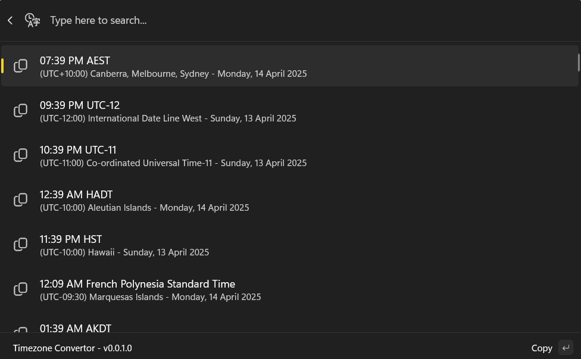
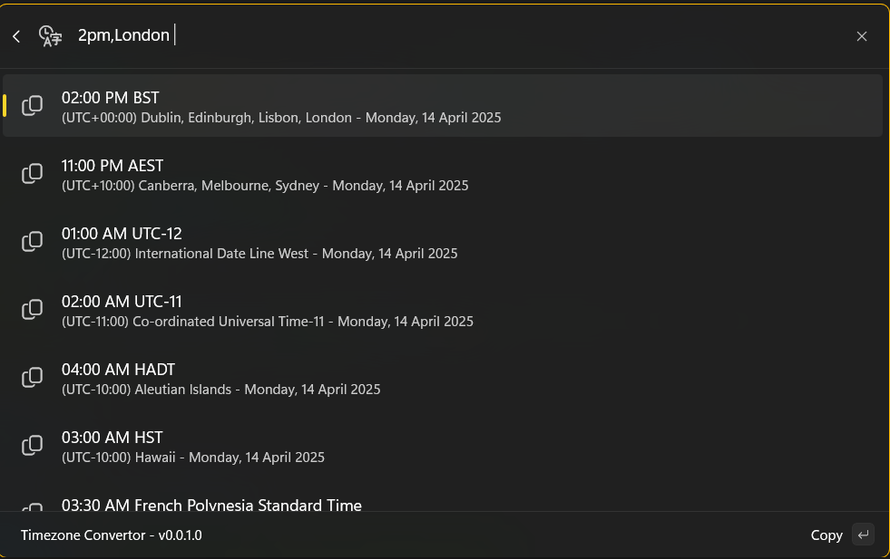
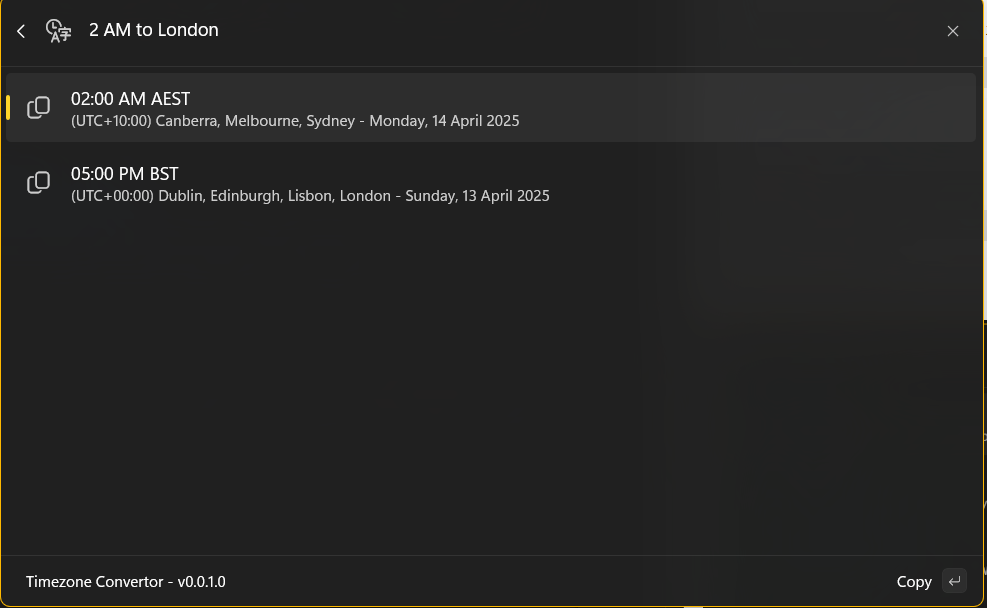

# Time Zone ConvertorCmdPalExtension

Time Zone Convertor CmdPalExtension is an extension for the PowerToys Command Palette that allows users to quickly convert time between different time zones.

## Features

- Effortlessly convert time between various time zones using the Command Palette.
- Simplify scheduling across multiple time zones.
- Support for a wide range of global time zones.
- Automatic Daylight Saving Time (DST) handling - displays correct UTC offsets based on the date.
- Shows timezone abbreviations (e.g., AEST, AEDT) with accurate UTC offset information.

## Requirements

- [PowerToys](https://github.com/microsoft/PowerToys) installed on your system.

## Installation

### Via Command Palette

Coming soon

### Via Microsoft store

<a href="https://apps.microsoft.com/detail/9P4TC0QM648H?mode=direct">
 
</a>


### Via Winget

Coming soon

## Usage

1. Open the PowerToys Command Palette.
2. Search for Time Zone Convertor using the extension.

### Show time zones

The extension will list all time zones for the current date and time. With the local time zone being on top



Supported date and time formats:
- `10:00 AM, London` (time only - uses current date)
- `Nov 21 2025 1:53PM, London` (month name format)
- `21 Nov 2025 1:53PM, London` (day month year format)
- `21/11/2025 1:53PM, London` (DMY format: MM/DD/YYYY)
- `11/21/2025 1:53PM, London` (MYK format: MM/DD/YYYY)
- `2025-11-21 13:53, London` (ISO format)

### Convert from another time zone

To convert a time from another time zone type the following

```
<date and time>, <time zone>
```

Supported date and time formats:
- `10:00 AM, London` (time only - uses current date)
- `Nov 21 2025 1:53PM, London` (month name format)
- `21 Nov 2025 1:53PM, London` (day month year format)
- `21/11/2025 1:53PM, London` (DMY format: MM/DD/YYYY)
- `11/21/2025 1:53PM, London` (MYK format: MM/DD/YYYY)
- `2025-11-21 13:53, London` (ISO format)

For example, to convert 10:00 AM in London to your local time zone, type:

```
10:00 AM, London
```

Or to convert a specific date and time:

```
Nov 21, 2025 1:53PM, London
```



### Convert to another time zone

To convert a time to another time zone type the following

```
<date and time> to <time zone>
```

Supported date and time formats (same as above):
- `10:00 AM` (time only - uses current date)
- `Nov 21, 2025 1:53PM` (month name format)
- `21 Nov 2025 1:53PM` (day month year format)
- `11/21/2025 1:53PM` (US format: MM/DD/YYYY)
- `2025-11-21 13:53` (ISO format)

For example, to convert 10:00 AM in your local time zone to London, type:

```
10:00 AM to London
```



## License

This project is licensed under the [MIT Licence](LICENCE).

## Contributing

Contributions are welcome! Feel free to submit issues or pull requests to improve this extension.

## Acknowledgments

- [PowerToys](https://github.com/microsoft/PowerToys) for providing a versatile Command Palette.
